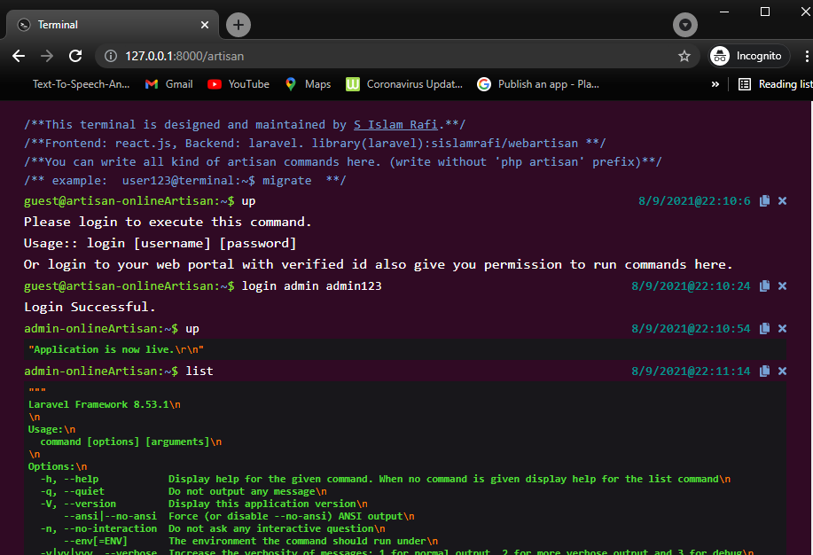

<!-- ABOUT THE PROJECT -->

## About The Package

If you want to run artisan commands in Laravel shared hosting this package is for you. This package will create a web based command line interface terminal which we can use to run artisan commands. User also can set username and password based auth security.



### Built With

- [Laravel(Backend)](https://laravel.com/)
- [React(Frontend)](https://reactjs.org/)

<!-- GETTING STARTED -->

## Getting Started

To get a local copy up and running follow these simple steps.

### Prerequisites

This is an example of how to list things you need to use the software and how to install them.

- Composer

### Package Installation

1.  Edit `composer.json` file. Add github repositories.

    ```
    "repositories": [
         {
             "url": "https://github.com/sislamrafi/webartisan",
             "type": "git"
         }
     ],
    ```

2.  Run Composer Require command
    ```sh
    composer require sislamrafi/webartisan
    ```
3.  Publish package
    ```sh
    php artisan vendor:publish --provider=Sislamrafi\Webartisan\WebArtisanServiceProvider
    ```
4.  Edit `\app\Http\Middleware\PreventRequestsDuringMaintenance.php` file.

    ```
    protected $except = [
         //
         '/artisan',
         '/artisan/submit',
     ];
    ```

    This step will help you to execute command in Maintenance mode

5.  Edit environment variable (in .env file). Add those variables
    ```
    ARTISAN_ADMIN_USERNAME=
    ARTISAN_ADMIN_TABLENAME=users
    ARTISAN_ADMIN_COLUMN=email
    ARTISAN_ADMIN_DEFAULT_PASS=
    ARTISAN_TERMINAL_NAME=artisanTerminal
    ARTISAN_GUEST_NAME=guest@terminal
    ```
        Default username = `admin` and pass=`admin123`.
    Here `ARTISAN_ADMIN_USERNAME` is the email or user name of admin. This package will first check if admin is login or not in the main website. If not it will request for login in terminal panel. `ARTISAN_ADMIN_TABLENAME` is the database table name of users or admins. `ARTISAN_ADMIN_COLUMN` is the table column name which will be checked to match `ARTISAN_ADMIN_USERNAME`.
6.  If you add this package to your existing project, don't forget to clear cache
    ```sh
    php artisan optimize:clear
    ```

<!-- USAGE EXAMPLES -->

## Usage

Simply navigate to url `https://127.0.0.0:8000/artisan` you will see a terminal. :)
Run any artisan command you want. enjoy :)
```sh
    migrate
    up
    down
    list
    cls
```
For loging to terminal use:
```sh
login [username] [password]
example:
login admin admin123
```
Here `cls` command will clear screen.
<!-- ROADMAP -->

## Roadmap

See the [open issues](https://github.com/sislamrafi/webartisan/issues) for a list of proposed features (and known issues).

<!-- CONTRIBUTING -->

## Contributing

Contributions are what make the open source community such an amazing place to be learn, inspire, and create. Any contributions you make are **greatly appreciated**.

1. Fork the Project
2. Create your Feature Branch (`git checkout -b feature/AmazingFeature`)
3. Commit your Changes (`git commit -m 'Add some AmazingFeature'`)
4. Push to the Branch (`git push origin feature/AmazingFeature`)
5. Open a Pull Request

<!-- LICENSE -->

## License

Distributed under the MIT License. See `LICENSE` for more information.

<!-- CONTACT -->

## Contact

S Islam Rafi - [sislamrafi333@gmail.com](https://www.facebook.com/sislam.rafi/) - email

Project Link: [https://github.com/sislamrafi/webartisan](https://github.com/sislamrafi/webartisan)

<!-- ACKNOWLEDGEMENTS -->

